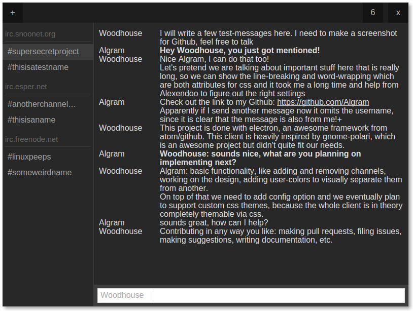
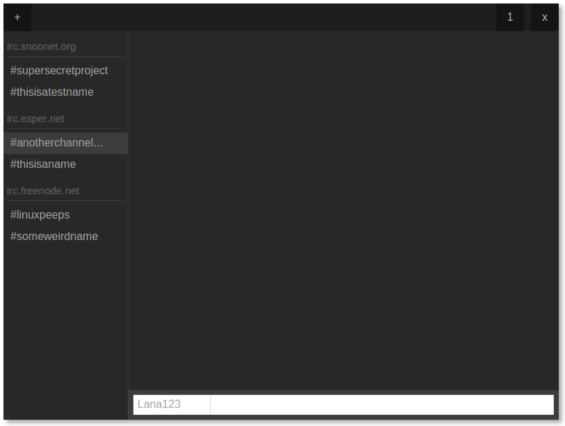

# Hypha

Work in Progress IRC-Client based on electron combined with HTML5 and CSS3.




You install it with
```bash
npm install

# Every time you run "npm install", run this
./node_modules/.bin/electron-rebuild

# On Windows if you have trouble, try:
.\node_modules\.bin\electron-rebuild.cmd

npm start
```
or

```bash
sudo npm install -g electron-prebuilt
cd directory/
electron .
```
